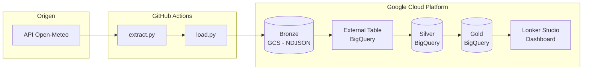

# Pipeline de Datos Climatológicos — MCI506

Pipeline de datos que extrae información del clima de 11 ciudades cada día, la almacena en Google Cloud y la transforma en métricas útiles para visualizar en un dashboard. Sigue una arquitectura medallion (Bronze → Silver → Gold).

**Participantes:**
- Grace Linda Romero Arancibia
- Jorge Branly Carrizales Yampara
- Juan Pablo Meriles

---

## 1. ¿Qué datos extrae?

Datos meteorológicos por hora de 11 ciudades: La Paz, Santa Cruz y Cochabamba (Bolivia), Buenos Aires (Argentina), Lima (Perú), Santiago (Chile), Bogotá (Colombia), Madrid (España), Quito (Ecuador), Asunción (Paraguay) y Montevideo (Uruguay).

Variables registradas por cada hora y ciudad:

| Campo | Descripción |
|---|---|
| `temperature_2m` | Temperatura a 2m del suelo (°C) |
| `apparent_temperature` | Sensación térmica (°C) |
| `relative_humidity_2m` | Humedad relativa (%) |
| `precipitation` | Precipitación acumulada (mm) |
| `wind_speed_10m` | Velocidad del viento a 10m (km/h) |
| `surface_pressure` | Presión atmosférica (hPa) |
| `cloud_cover` | Cobertura nubosa (%) |

Cada corrida genera aproximadamente **792 filas** (11 ciudades × 72 horas).

---

## 2. ¿De dónde vienen los datos?

De [Open-Meteo](https://open-meteo.com), una API meteorológica gratuita que no requiere registro ni API key.

- **Endpoint:** `https://api.open-meteo.com/v1/forecast`
- **Parámetros:** `past_days=2`, `forecast_days=1`, `timezone=UTC`
- El `past_days=2` hace que cada corrida traiga las últimas 72 horas, generando solapamiento intencional entre ejecuciones que Silver deduplica con `WHERE NOT EXISTS`

---

## 3. ¿A dónde se guardan?

Los datos pasan por tres capas:

**Bronze → Google Cloud Storage**
```
gs://mci506-weather-bronze/weather/extracted_date=YYYY-MM-DD/weather_<timestamp>.ndjson
```

**Silver → BigQuery** (`weather_pipeline.silver_weather`)
Datos limpios, tipados y sin duplicados. Llave natural: `(city, time)`.

**Gold → BigQuery** (`weather_pipeline.gold_weather_daily`)
Métricas diarias por ciudad listas para el dashboard: temperatura promedio/máxima/mínima, lluvia total, viento y humedad.

---

## 4. ¿Cuándo se ejecuta?

Dos automatizaciones independientes:

| Automatización | Horario | Acción |
|---|---|---|
| GitHub Actions | 06:00 UTC (02:00 AM Bolivia) | `extract.py` → `load.py` → GCS |
| Scheduled Query BigQuery | 07:00 UTC | Recalcula `gold_weather_daily` desde Silver |

---

## 5. ¿Cómo funciona?



La parte más importante es la deduplicación incremental en Silver:

```sql
INSERT INTO silver_weather
SELECT ... FROM bronze_weather_raw AS bronze
WHERE NOT EXISTS (
    SELECT 1 FROM silver_weather AS silver
    WHERE silver.city = bronze.city
      AND silver.time = TIMESTAMP(bronze.time)
)
AND bronze.city IS NOT NULL
AND bronze.time IS NOT NULL
```

Esto garantiza que cada par `(ciudad, hora)` aparezca exactamente una vez, sin importar cuántas veces haya corrido el pipeline.

---

## 6. ¿Qué calidad tienen los datos?

| Validación | Dónde | Descripción |
|---|---|---|
| Duplicados | Silver | `WHERE NOT EXISTS` sobre `(city, time)` |
| Nulos | Silver | Se excluyen filas sin ciudad o sin timestamp |
| Errores de red | `extract.py` | Hasta 5 reintentos con backoff exponencial |
| Ciudades fallidas | `extract.py` | Se omiten y el pipeline continúa con las demás |
| Trazabilidad | Silver y Gold | `extracted_at` y `loaded_at` en cada fila |
| Precisión | Gold | Métricas redondeadas a 2 decimales |

---

## 7. ¿Qué hacer si falla?

**Ver qué pasó:**
- GitHub → pestaña **Actions** → clic en la ejecución fallida → expandir el paso con error
- BigQuery → **Trabajos programados** → historial de `gold_daily_refresh`

**Errores frecuentes:**

| Error | Causa | Solución |
|---|---|---|
| Autenticación fallida | Secret `GCP_SA_KEY` inválido | Regenerar llave en IAM y actualizar secret en GitHub |
| Bucket no encontrado | Nombre incorrecto | Verificar `GCS_BUCKET_NAME` en `pipeline.yml` |
| Permission denied | Permisos insuficientes | Revisar roles: Storage Admin, BigQuery Data Editor, BigQuery Job User |
| No se encontraron NDJSON | `extract.py` falló antes | Revisar el paso anterior en el log de Actions |
| Timeout de API | Caída temporal de Open-Meteo | El script reintenta 5 veces; si persiste, ejecutar manualmente |

**Ejecución manual:** GitHub → Actions → Weather Pipeline → **Run workflow**

---

## Estructura del proyecto

```
mci506-weather-pipeline/
├── .github/workflows/
│   └── pipeline.yml
├── scripts/
│   ├── extract.py
│   └── load.py
├── sql/
│   ├── silver_transform.sql
│   └── gold_aggregations.sql
├── .env.example
├── requirements.txt
└── README.md
```

---

## Dashboard

https://datastudio.google.com/reporting/d1e06669-edb0-4a1f-bad0-b955a80602df

---

## Stack

Python 3.11 · Open-Meteo API · Google Cloud Storage · BigQuery · GitHub Actions · Looker Studio
